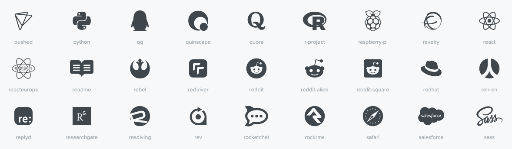
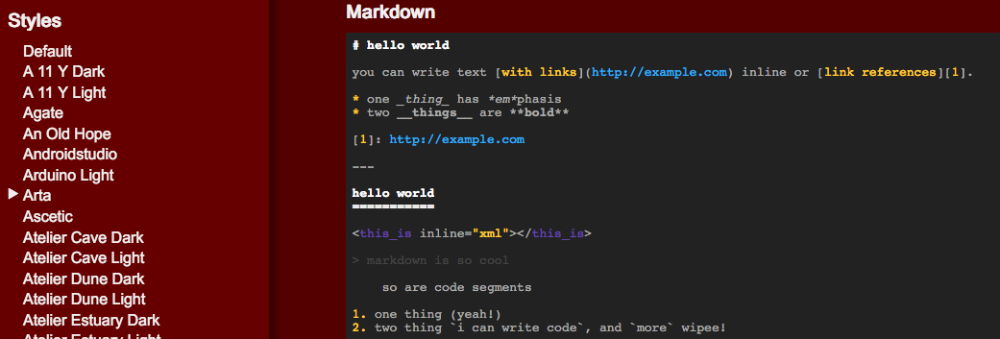
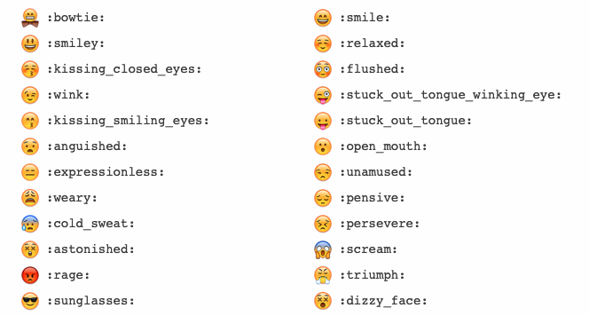
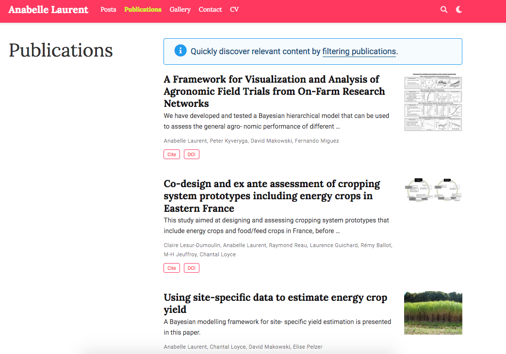
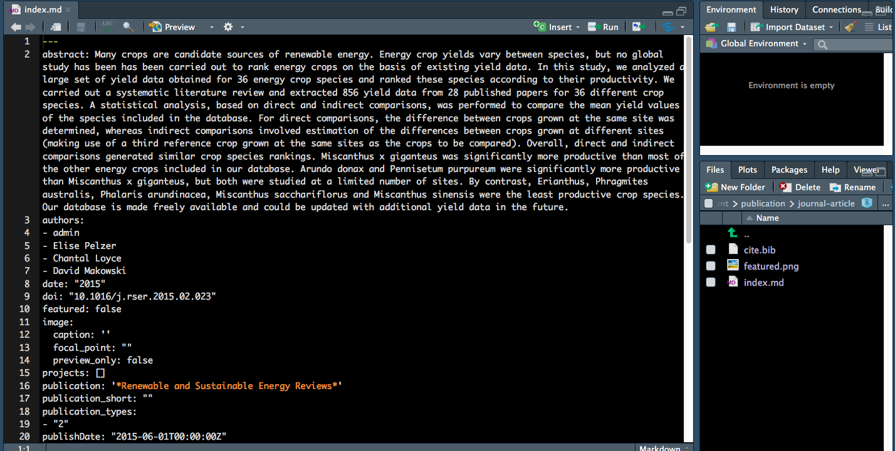
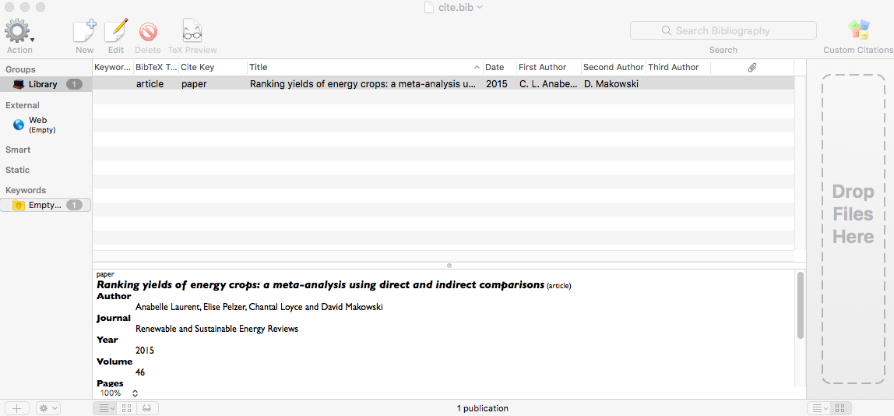

```{r setup, include=FALSE}
options(htmltools.dir.version = FALSE)
```

# Why a personal website?

- Be professional `r emo::ji("necktie")`

  + [Some advice on managing your online presence - Hadley Wickham](https://twitter.com/hadleywickham/status/1189971594778681344)

--

- Autobiography `r emo::ji("book")`

  + [I web, therefore I am. - Yihui Xie](https://bookdown.org/yihui/blogdown/)

--

- Learning and Sharing `r emo::ji("speaker")`

  + [The unreasonable effectiveness of public work - David Robinson](https://resources.rstudio.com/rstudio-conf-2019/the-unreasonable-effectiveness-of-public-work)
  
  + [Becoming an R blogger - Rebecca Barter](http://www.rebeccabarter.com/blog/2020-02-03_blogger/)

--

- Have fun programming and blogging! `r emo::ji("grin")`

  + [Twitter Threads vs Blogging - Yihui Xie](https://yihui.org/en/2017/08/twitter-threads-vs-blogging/)

---

<body>
<style type="text/css">
body, html
{
margin: 0; padding: 0; height: 100%; overflow: hidden;
}
#content
{
position:absolute; left: 0; right: 0; bottom: 0; top: 0px; 
}
</style>
<div id="content">
<iframe width="100%" height="100%" frameborder="0" src="https://annielyu.com/2020/01/12/blogdown-website/"/>
</div>
</body>

---

<body>
<style type="text/css">
body, html
{
margin: 0; padding: 0; height: 100%; overflow: hidden;
}
#content
{
position:absolute; left: 0; right: 0; bottom: 0; top: 0px; 
}
</style>
<div id="content">
<iframe width="100%" height="100%" frameborder="0" src="http://anabellelaurent.com/"/>
</div>
</body>

---
class: inverse

background-image: url(https://media.giphy.com/media/mohhXPUdhVVoA/giphy.gif)
background-size: 100%
background-position: 50% 50%

---
# How to get it done?

1. customize your content by modifying a template website -- <span style="color:blue">lots of work</span> `r emo::ji("sweat_smile")`

  + `install.packages("blogdown")`
  
  + `blogdown::install_hugo()`

--

1. custom domain name -- <span style="color:blue">straightforward</span> `r emo::ji("smile")`

  + Google Domains (.com, .org, .me) for a cost of $12 per year
  
  + Google Analytics (monitor website traffic for free)
  
--

1. publish with GitHub and Netlify -- <span style="color:blue">somewhat tricky</span> `r emo::ji("persevere")`

  + tell Netlify to continuously build and deploy your website from source
  
  + configure custom domain DNS

---
## RStudio and Website using blogdown 

New Project $\rightarrow$ New Directory $\rightarrow$ Website using blogdown 

<center></center>

---
## RStudio and Website using blogdown

New Project $\rightarrow$ New Directory $\rightarrow$ Website using blogdown 


---
background-image: url(images/serve_site.png)
background-size: 100%
background-position: 50% 50%

---
class: inverse

## Your Turn

- Create a new website using the RStudio dialog to set it up in a new project.

  + pick a [hugo theme](https://themes.gohugo.io/) you like (we'll use hugo-academic as an example)

- Live preview a website locally (Addins -> Serve Site).

---
## File structure

- configuration: <span style="color:blue">a few site settings to go through</span>

  + config.toml

  + config/_default/*.toml $\Rightarrow$ languages, menus, params

--

- content: <span style="color:blue">mostly markdown files</span>

  + home/*.md -- homepage widgets

  + authors/admin -- your biography
  
  + post, talk, project, publication -- your achievements `r emo::ji("100")`  

--

- static: <span style="color:blue">self imported files</span>

  + images, slides, resume, etc. 

--

- <mark>**DO NOT TOUCH**</mark>: public, resources, themes

---
## Homepage Widgets (content/home)

<center></center>

---
## Homepage Widgets (content/home) 

- `active = true`: keep widget; `active = false`: discard widget

- `weight`

  + display order (small weight shows first)
  
  + works in the same way for both <span style='color:blue'>homepage widgets</span> and <span style='color:blue'>navigation bar menus</span>

For example, `content/home/accomplishments.md`

```yaml
+++
# Accomplishments widget.
widget = "accomplishments"  
headless = true  # This file represents a page section.
active = false  # Activate this widget? true/false
weight = 50  # Order that this section will appear.
```

---
## Biography (content/authors/admin)

- folder name **admin** can be replaced with a customized user name

- edit `authors/admin/_index.md` to introduce yourself

- replace `authors/admin/avatar.jpg` with your profile picture

<center></center>

---
## Biography (content/authors/admin/_index.md) 

<center></center>

---
## Resources - icons `r icon::fa("r-project")`

- `"<i class="fab fa-r-project"></i>"` versus `"r icon::fa('r-project')"`

- [Fontawesome](https://fontawesome.com/icons?d=gallery)



---
class: inverse

## Your turn

- Fill in your information (at least name, organization and role)

Optional

- Activate/deactivate the sections (widgets) on the homepage

- Rearrange the section orders however you like

---
## Create a new R Markdown post (content/post)

- use the **New Post** Addin (or run `blogdown::new_post(ext = '.Rmd')`)

<center></center>

---
## Create a new R Markdown post (content/post)

<mark>**Do not knit**</mark> your post, instead

  + use the **Serve Site** Addin to preview your post, or
  
  + refresh preview
  
In YAML header,

  + `draft:TRUE` $\Rightarrow$ preview an R markdown post

  + `draft:FALSE` $\Rightarrow$ ready to deploy a post

---
## Resources - Highlight (config/_default/params.toml)

- [Styles](https://highlightjs.org/static/demo/)

<!-- - activate `highlight = true` and write down your style `highlight_style = "arta"` -->

```yaml
highlight = true
highlight_languages = ["r"]  
highlight_style = "arta" 
```

<center></center>

---
## Resources - Emoji `r emo::ji("sunglasses")`

- `":sunglasses:"` versus `"r emo::ji('sunglasses')"`

- [Cheat sheet](https://www.webfx.com/tools/emoji-cheat-sheet/)



---

## Resources - Shortcodes

- [Hugo's Build-in Shortcodes](https://gohugo.io/content-management/shortcodes/)

- ``

<center><iframe width="680" height="383" src="https://www.youtube.com/embed/CjTLN-FXiFA" frameborder="0" allow="accelerometer; autoplay; encrypted-media; gyroscope; picture-in-picture" allowfullscreen></iframe></center>

---
## Import files (static)

For image not created from your R Markdown file, you should
 
 + add image to the `static/img` folder
 
 + insert your image using ``

--

Any files in the `static` folder can be referred using similar relative path!

--

Follow the following steps to link your resume to the navigation bar:

1. add your resume to the `static/files` folder

1. Specify the URL to your resume in `config/_default/menus.toml`

```yaml
 [[main]]
    name = "Resume" # displayed text
    url = "files/resume.pdf"
    weight = 70
```

---
## About hyperlink

- relative path will be after your domain name (e.g., `https://xxx.com/`),

  + homepage section (widget): `[text](#posts)`
  
  + tags: `[text](tags/rstats)`
  
  + categories `[text](categories/r)`
  
--
  
- DO NOT leave out prefix `https://` when directing visitor to external webpages.

--

- Recommended practice for generating permanent links in `config.toml`

  + `slug` serves as a short page ID
  
  + URL won't change as you move around or rename file/folder
  
```yaml
# Rules to generate permanent links of your pages
[permalinks]
    post = "/:year/:month/:day/:slug/"
    publication = "/publication/:slug/"
    talk = "/talk/:slug/"
```

---
## Create a new publication (content/publication)

<center></center>

---
## Create a new publication (content/publication)

Per publication folder, you need

  + a Markdown file `index.md`
  + an optional featured image `featured.png` 
  + an optinal citation `cite.bib` 

<center></center>
  
---
exclude: true
## Resources - citation

- use **bibtex** format. Open `cite.bib` on **BibDesk**

<center></center>

---
class: inverse

## Your Turn

- Create a "hello world" post

- Preview your post

Optional

- Try inserting 

  + code chunk
  
  + emoji
  
  + icon 
  
  + image
  
  + hyperlink to internal pages

---
## Additional Site configurations

- `config/_default/params.toml`

  + your contact information (if you activate `content/home/contact.md`)

  + site name and description $\rightarrow$ `title` and `description`

  + custom domain and Google analytics $\rightarrow$ `baseurl` and `google_analytics`

  + active comments $\rightarrow$ `comments`

- `config.toml`

  + enable emoji $\rightarrow$ `enableEmoji = true`

  + activate Chinese/Japanese/Korean languages $\rightarrow$ `hasCJKLanguage = true`

---
## Deploy with Netlify and GitHub

- Push your repository to [GitHub](https://github.com/)

  + can be private and ignore the `public` folder

--

<center></center>

---
class: middle, center

## Thank you `r icon::fa("heart")`

<center></center>

I get out of my pod `r emo::ji("laughing")`

