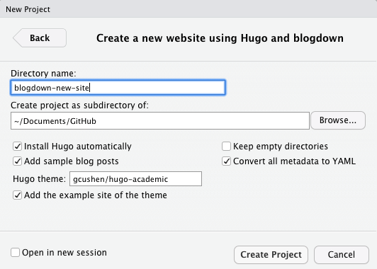
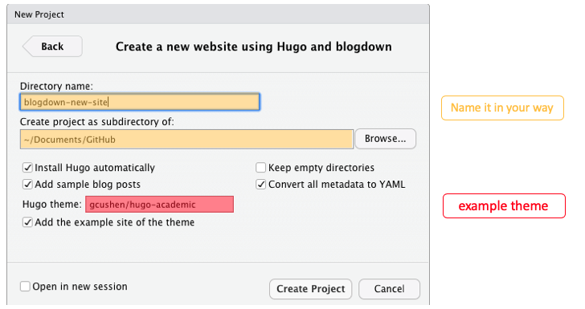
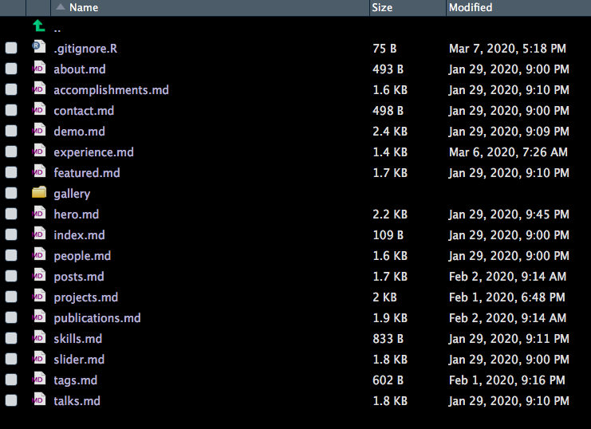
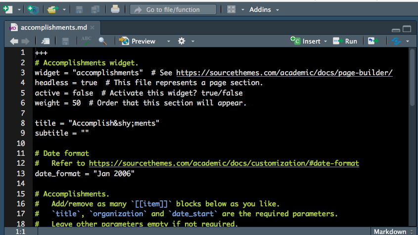
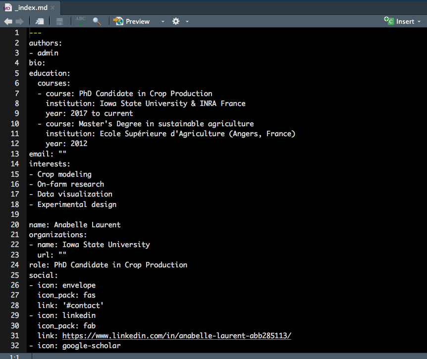
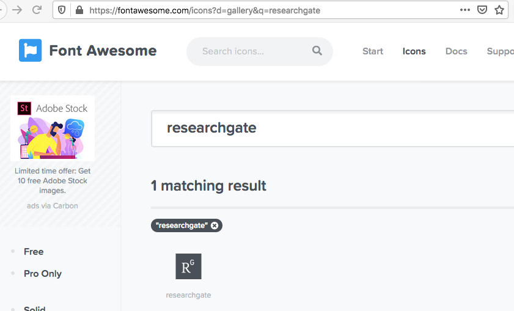

```{r setup, include=FALSE}
options(htmltools.dir.version = FALSE)
```

# Why a personal website?

- Be professional `r emo::ji("necktie")`

  + [Some advice on managing your online presence - Hadley Wickham](https://twitter.com/hadleywickham/status/1189971594778681344)

--

- Autobiography `r emo::ji("book")`

  + [我网故我在](https://yihui.org/cn/2016/12/student-project/)

--

- Learning and Sharing `r emo::ji("speaker")`

  + [The unreasonable effectiveness of public work - David Robinson](https://resources.rstudio.com/rstudio-conf-2019/the-unreasonable-effectiveness-of-public-work)
  
  + [Becoming an R blogger](http://www.rebeccabarter.com/blog/2020-02-03_blogger/)

--

- Have fun programming and blogging! `r emo::ji("grin")`

  + [Twitter Threads vs Blogging - Yihui Xie](https://yihui.org/en/2017/08/twitter-threads-vs-blogging/)

---

<body>
<style type="text/css">
body, html
{
margin: 0; padding: 0; height: 100%; overflow: hidden;
}
#content
{
position:absolute; left: 0; right: 0; bottom: 0; top: 0px; 
}
</style>
<div id="content">
<iframe width="100%" height="100%" frameborder="0" src="https://annielyu.com/2020/01/12/blogdown-website/"/>
</div>
</body>

---

<body>
<style type="text/css">
body, html
{
margin: 0; padding: 0; height: 100%; overflow: hidden;
}
#content
{
position:absolute; left: 0; right: 0; bottom: 0; top: 0px; 
}
</style>
<div id="content">
<iframe width="100%" height="100%" frameborder="0" src="http://anabellelaurent.com/"/>
</div>
</body>

---
# How to get it done?

1. file structures of blogdown websites

  + `install.packages("blogdown")`

--

1. custom domain name

  + Google Domains (.com, .org, .me) for a cost of $12 per year
  
  + Google Analytics (monitor website traffic for free)
  
--

1. deploy with GitHub and Netlify

  + tell Netlify to auto build your website through your GitHub repo

---
## RStudio and Website using blogdown

New Project -> New Directory -> Website using blogdown 



---
## RStudio and Website using blogdown

New Project -> New Directory -> Website using blogdown 



---
background-image: url(images/serve_site.png)
background-size: 100%
background-position: 50% 50%

---
class: inverse

## Your Turn

- Create a new website using the RStudio dialog to set it up in a new project.

  + pick a [hugo theme](https://themes.gohugo.io/) you like (we'll use the hugo-academic as an example)

- Live preview a website locally (Addins -> Serve Site).

---
## File structure

- configuration

  + config.toml

  + config/_default/*.toml => languages, menus, params

- content

  + <mark>home/*.md</mark>

  + authors/admin
  
  + post, talk, project, publication

- static

  + img, files, etc. 

- **DO NOT TOUCH**: public, resources, themes


---
## Modify content/home 

<center></center>

---
## Modify content/home 

- keep sections or discard unwanted ones by setting `activate=true` or `activate=false`

  + see line 5

- adjust the order of each section by setting the value of `weight` 

<center></center>

---
## Modify content/authors/admin 

- edit the file authors/admin/_index.md to personnalize the top of your home page

- place your profil picture in the folder authors/admin (use jpg format) 

<center></center>

---
## Modify content/authors/admin 

- edit the file authors/admin/_index.md to personnalize the top of your home page

<center></center>

---
## Modify content/authors/admin 

- use [Font Awesome](https://fontawesome.com/icons?d=gallery) website to customize your social medias

<center></center>


---
# Caveats

