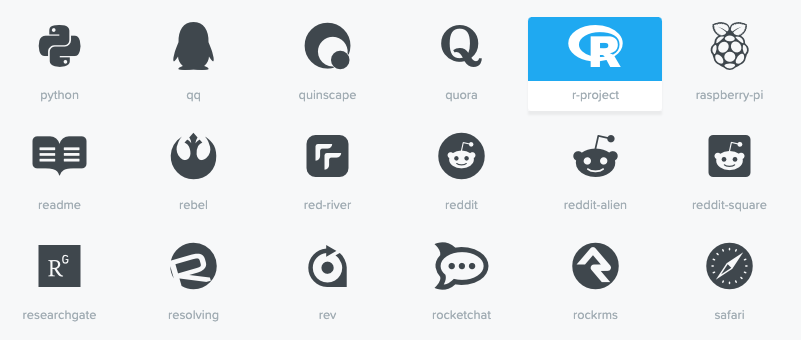

```{r setup, include=FALSE}
options(htmltools.dir.version = FALSE)
```

# Why a personal website?

- Be professional `r emo::ji("necktie")`

  + [Some advice on managing your online presence - Hadley Wickham](https://twitter.com/hadleywickham/status/1189971594778681344)

--

- Autobiography `r emo::ji("book")`

  + [我网故我在 - Yihui Xie](https://yihui.org/cn/2016/12/student-project/)

--

- Learning and Sharing `r emo::ji("speaker")`

  + [The unreasonable effectiveness of public work - David Robinson](https://resources.rstudio.com/rstudio-conf-2019/the-unreasonable-effectiveness-of-public-work)
  
  + [Becoming an R blogger - Rebecca Barter](http://www.rebeccabarter.com/blog/2020-02-03_blogger/)

--

- Have fun programming and blogging! `r emo::ji("grin")`

  + [Twitter Threads vs Blogging - Yihui Xie](https://yihui.org/en/2017/08/twitter-threads-vs-blogging/)

---

<body>
<style type="text/css">
body, html
{
margin: 0; padding: 0; height: 100%; overflow: hidden;
}
#content
{
position:absolute; left: 0; right: 0; bottom: 0; top: 0px; 
}
</style>
<div id="content">
<iframe width="100%" height="100%" frameborder="0" src="https://annielyu.com/2020/01/12/blogdown-website/"/>
</div>
</body>

---

<body>
<style type="text/css">
body, html
{
margin: 0; padding: 0; height: 100%; overflow: hidden;
}
#content
{
position:absolute; left: 0; right: 0; bottom: 0; top: 0px; 
}
</style>
<div id="content">
<iframe width="100%" height="100%" frameborder="0" src="http://anabellelaurent.com/"/>
</div>
</body>

---
class: inverse

background-image: url(https://media.giphy.com/media/mohhXPUdhVVoA/giphy.gif)
background-size: 100%
background-position: 50% 50%

---
# How to get it done?

1. customize your content by modifying a template website -- <span style="color:blue">lots of work</span> `r emo::ji("sweat_smile")`

  + `install.packages("blogdown")`

--

1. custom domain name -- <span style="color:blue">straightforward</span> `r emo::ji("smile")`

  + Google Domains (.com, .org, .me) for a cost of $12 per year
  
  + Google Analytics (monitor website traffic for free)
  
--

1. publish with GitHub and Netlify -- <span style="color:blue">somewhat tricky</span> `r emo::ji("persevere")`

  + tell Netlify to auto build your website through your GitHub repo
  
  + configure custom domain DNS

---
## RStudio and Website using blogdown

New Project -> New Directory -> Website using blogdown 


---
## RStudio and Website using blogdown

New Project -> New Directory -> Website using blogdown 


---
background-image: url(images/serve_site.png)
background-size: 100%
background-position: 50% 50%

---
class: inverse

## Your Turn

- Create a new website using the RStudio dialog to set it up in a new project.

  + pick a [hugo theme](https://themes.gohugo.io/) you like (we'll use hugo-academic as an example)

- Live preview a website locally (Addins -> Serve Site).

---
## File structure

- configuration: <span style="color:blue">a few site settings to go through</span>

  + config.toml

  + config/_default/*.toml $\Rightarrow$ languages, menus, params

--

- content: <span style="color:blue">mostly markdown files</span>

  + home/*.md -- homepage layout

  + authors/admin -- your biography
  
  + post, talk, project, publication -- your achievements `r emo::ji("100")`  

--

- static: <span style="color:blue">self imported files</span>

  + images, slides, resume, etc. 

--

- <mark>**DO NOT TOUCH**</mark>: public, resources, themes

---
## Homepage Layout (content/home)

<center></center>

---
## Homepage Layout (content/home) 

- `active = true`: keep section; `active = false`: discard section (line 5)

- `weight`: section order (small weight shows first, line 6)

<center></center>

---
## Biography (content/authors/admin)

- edit authors/**admin**/_index.md to introduce yourself

- replace authors/admin/avatar.jpg with your profile picture

<center></center>

---
## Biography (content/authors/admin/_index.md) 

<center></center>

---
## Resources - icons `r icon::fa("r-project")`

- [Fontawesome](https://fontawesome.com/icons?d=gallery) and `"r icon::fa()"`



---
## Resources - Emoji `r emo::ji("sunglasses")`

- [Cheat sheet](https://www.webfx.com/tools/emoji-cheat-sheet/) and `"r emo::ji()"`


---
class: inverse

## Your turn

- Clean up the sections on the homepage (optional)

- Fill in your information (at least name, organization and role)

---
## Create a new R Markdown post (content/post)

- use the **New Post** Addin (or run `blogdown::new_post(ext = '.Rmd')`)

<center></center>

---
## Create a new R Markdown post (content/post)

<mark>**Do not knit**</mark> your post, instead

  + use the **Serve Site** Addin to preview your post, or
  
  + refresh preview
  
- In YAML header,

  + `draft:TRUE` $\Rightarrow$ preview an R markdown post

  + `draft:FALSE` $\Rightarrow$ ready to deploy a post

---
## Import files (static)

For image not created from your R Markdown file, you should
 
 + add image to the `static/img` folder
 
 + insert your image using ``

--

Any files in the `static` folder can be referred using similar relative path!
 
---
class: inverse

## Your Turn

- Create a "hello world" post

---
## Create a new Markdown publication (content/publication)

<center></center>

---
## Create a new Markdown publication (content/publication)

<center></center>

Per publication folder, you need

  + a markdown file, a picture (.png format), and a citation 
  
---
## Add a publication citation

- use **bibtex** format. Open cite.bib on **BibDesk**

<center></center>

---
## Deploy with Netlify and GitHub

